# Vonage Meetings — Portfolio Case Study

> Source: Dave Orian's old portfolio (Webflow), page "Vonage Meetings"
> Extracted in visual/DOM order, with page hierarchy preserved.

## Site navigation (top nav, sticky)

- **Dave Orian** (logo/home link) → `/`
- CV → https://drive.google.com/file/d/19i2iU_uEzZHtscwUIS_jOexJwxok70XU/view
- LinkedIn → https://www.linkedin.com/in/daveorian/
- About me → `/about-me`

## Project header

  |  **Meetings**

### PROJECT OVERVIEW *(eyebrow/label)*

**Vonage Meetings combines video meetings, live collaboration and recording for small and large businesses.** *(large bold headline)*

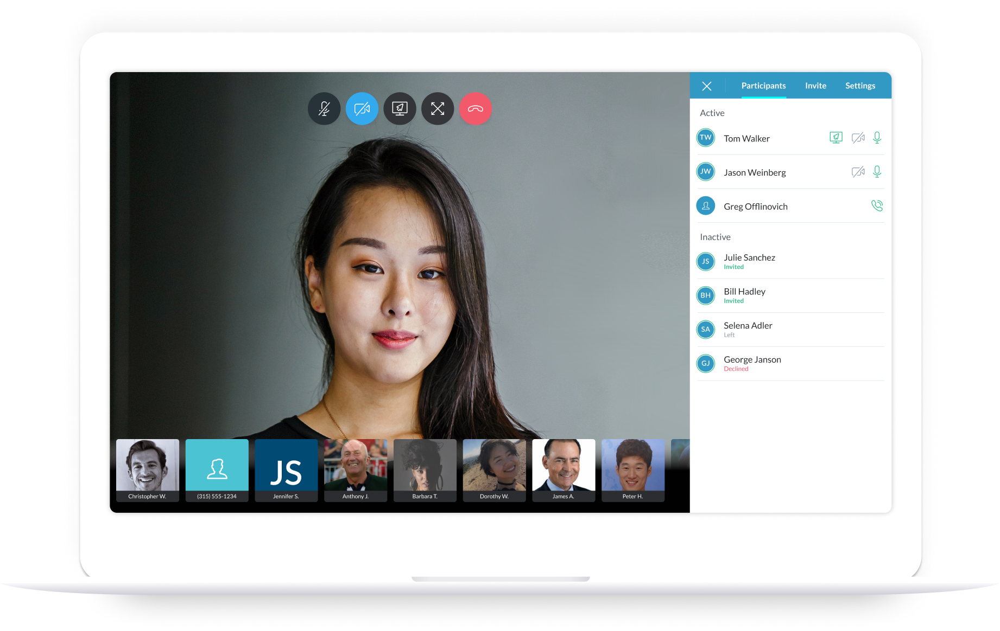

---

## 1 — Example user flow

### Creating a new Meeting

Vonage Business Cloud (VBC) is a cloud communications solution for small and large businesses. Communication is the pain that Vonage wants to solve, and naturally many customers asked for a Video Conferencing solution.

To create a new Meeting, users navigate to the "Meetings" product within VBC and click on "New Meeting".

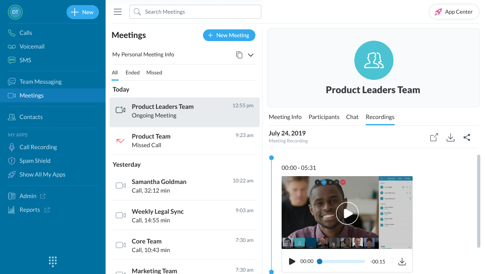

Vonage Business Cloud (VBC) is a cloud communications solution for small and large businesses. Communication is the pain that Vonage wants to solve, and naturally many customers asked for a Video Conferencing solution.

*(Note: the paragraph above appears twice in the source page, once before and once after the step‑2 image — likely an authoring duplicate in the original site.)*

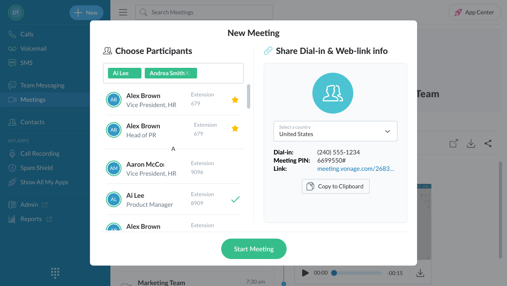

Upon clicking "New Meeting", a modal is displayed where the user can invite others or copy the Meeting info to share with others.

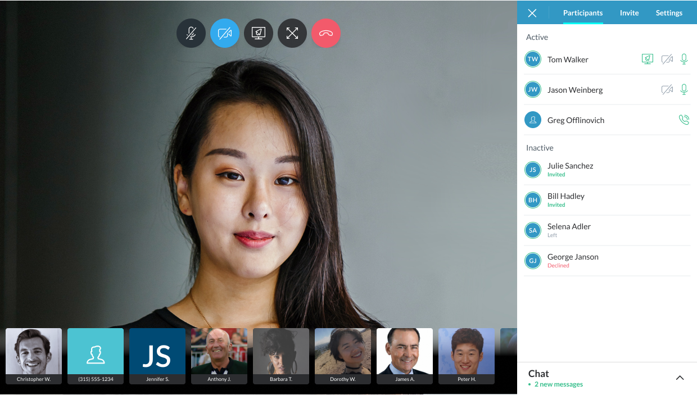

*Caption: A live Meeting. Call actions can be controlled on the top part of the screen; The side panel allows the user to easily access a wide range of actions quickly.*

From the moment a user is in a Meeting, the side navigation is their main tool to navigate the Meeting. In the stages the preceded GA (General Availability) we received feedback from more than 200 users regarding Meetings and made adjustments to the side navigation according to much of that feedback.

---

## 2 — Before & after

### Redesigning the Meetings sidebar

The side navigation in a Meeting is critical—it's how users can navigate their Meetings experience. There were some challenges that users experienced and we dedicated a sprint to focus solely on the side navigation.

#### Side navigation: Before

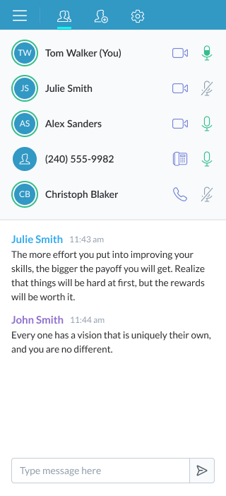
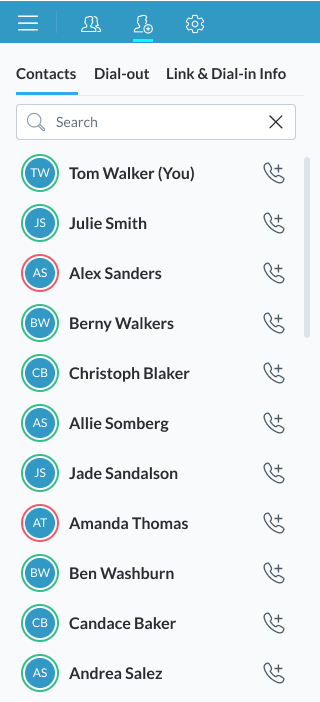
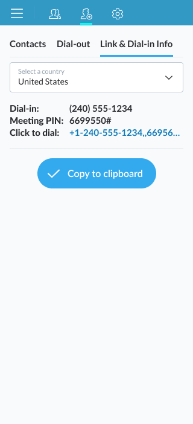

One of the changes that were made were the navigation icons. According to usability tests it wasn't clear to users what each tab icon represented. Icons are often thought of as ineffective labels, being very difficult to interpret correctly without training or experience, so the icons were replaced with text.

#### Side navigation: After

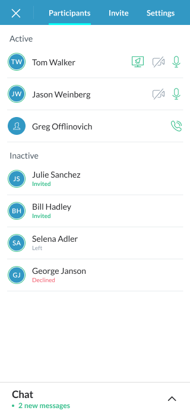
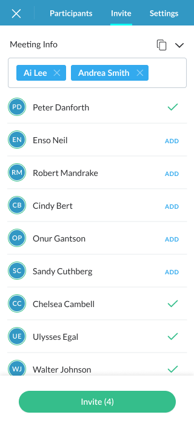
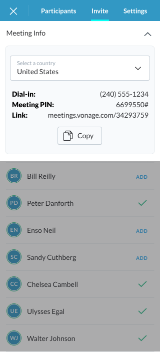

After the Alpha stage of testing we also noticed that there is not enough differentiation between Participants' statuses - and we added two points of indication in the UI: Clearer separation of who is active and who is inactive in the Meeting, and if they are inactive what their sub-status is.

---

## 3 — Meetings mobile

### Translating the Meetings Desktop experience for mobile devices

**Flow A — Calls / New Meeting**

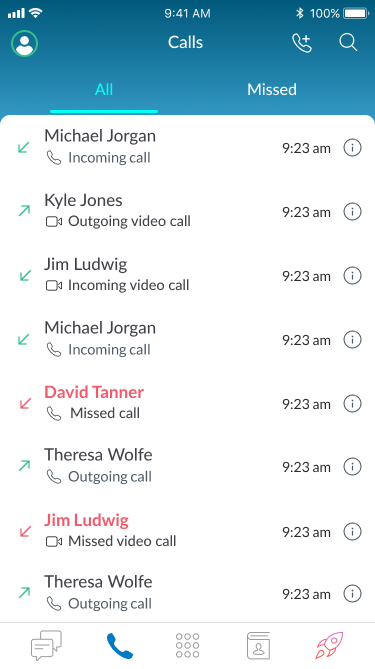
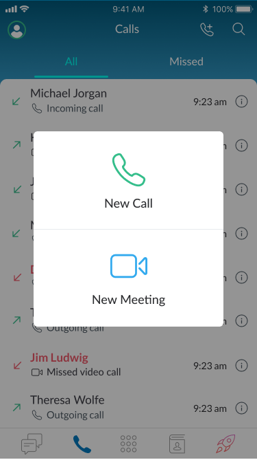
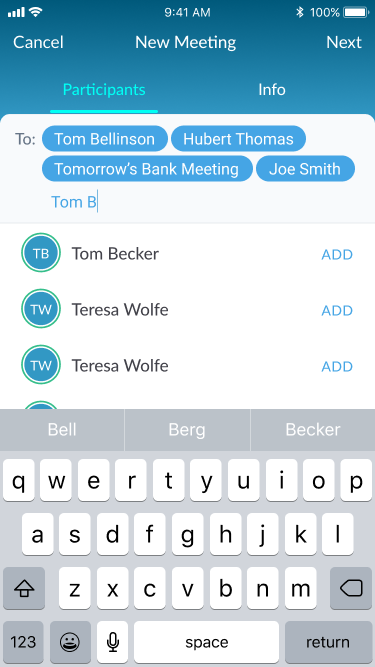
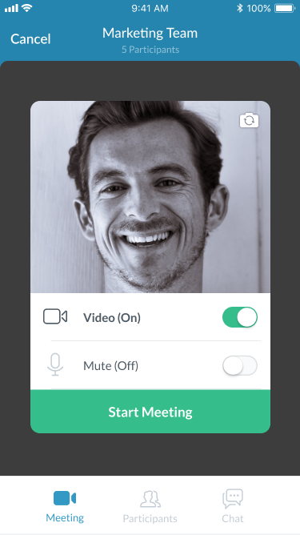
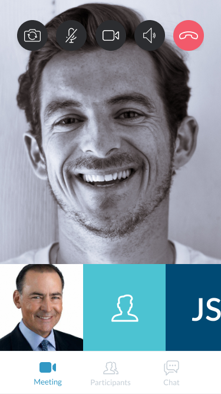

We wanted to [provide a] user experience that was consistent with the conventions of Meetings for Desktop. In both cases we provided the user with a prominent toolbar through which the users can edit the Participants of the Meeting or send Chat messages throughout the Meeting.

*(Note: source text reads "We wanted to user experience that was consistent..." — appears to be missing a word/typo in the original site copy; likely intended as "We wanted to provide a user experience...".)*

**Flow B — Manage Participants / Chat**

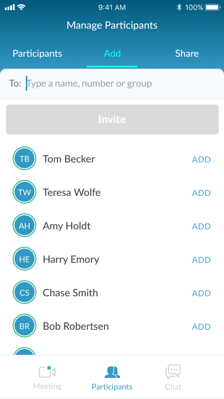
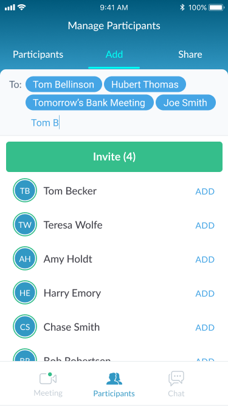
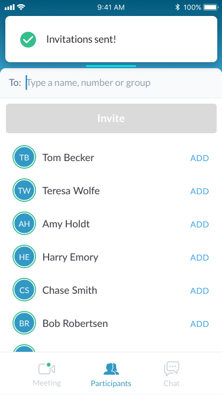
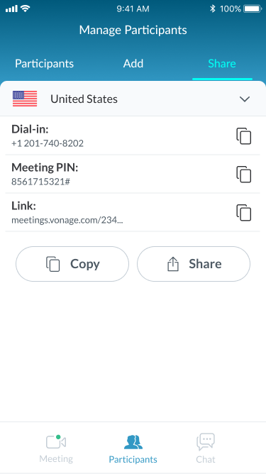
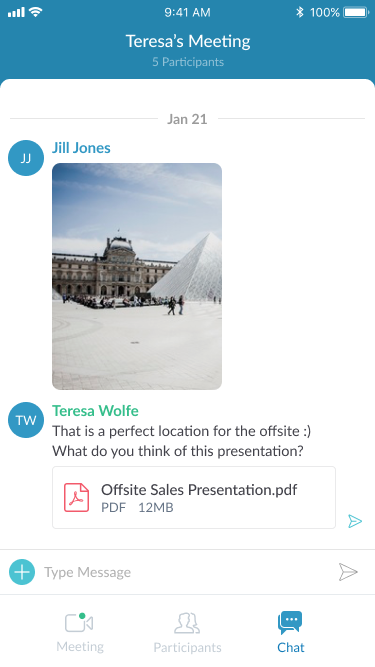

---

## Final thoughts

Within its first three months Vonage Meetings grew to facilitate over 100 Meetings per day growing at a rate of 15%. Meetings reached a significant milestone during Covid, as many worked from home and needed an integrated video conference solution for their company.

---

**NEXT PROJECT:** Vonage Receptionist → `/receptionist-app-for-desktop`
