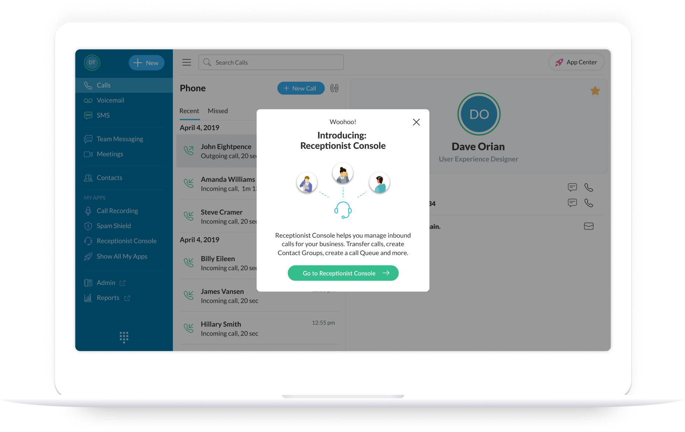
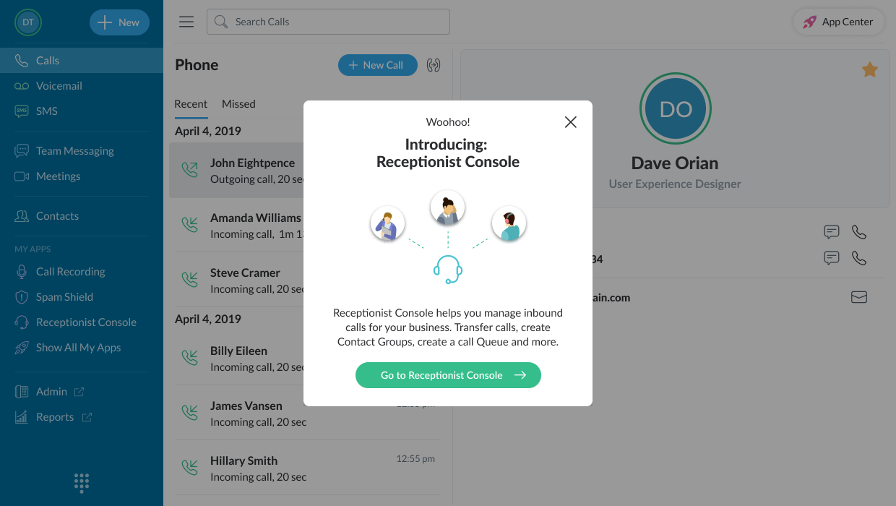
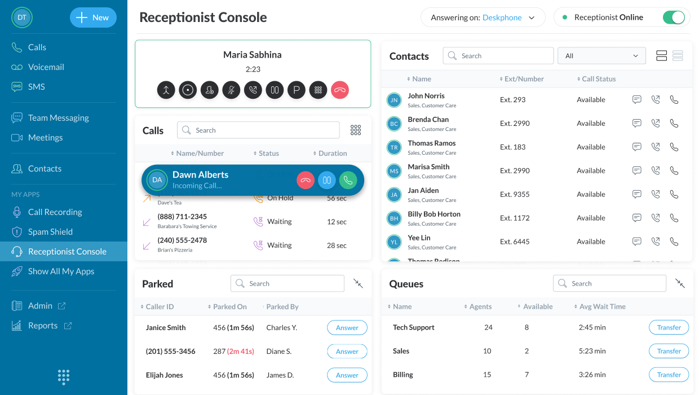
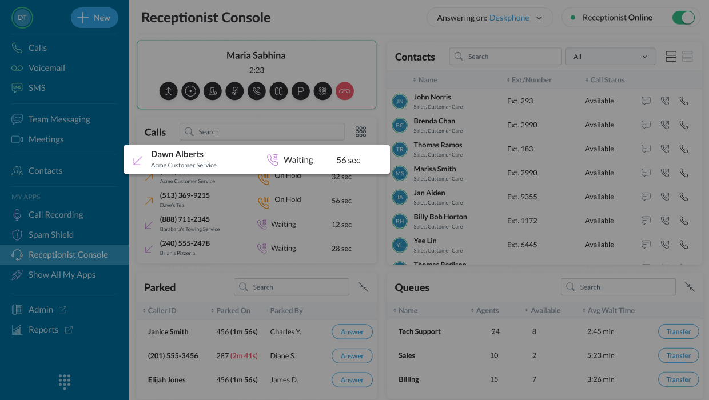
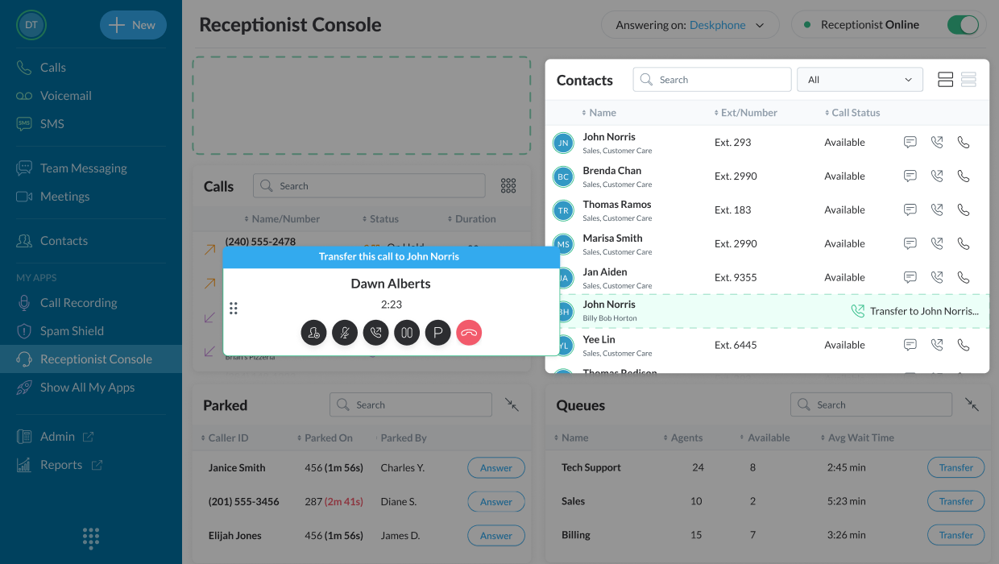
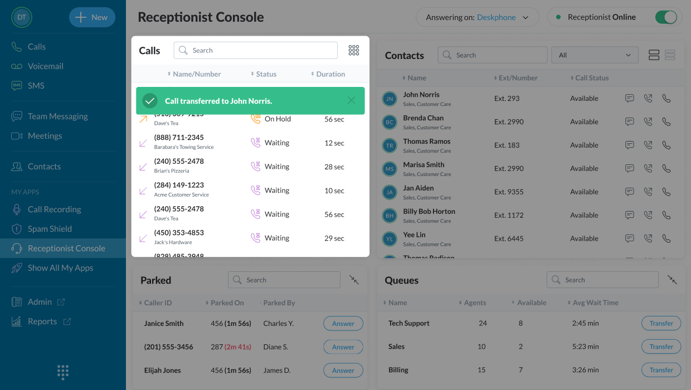
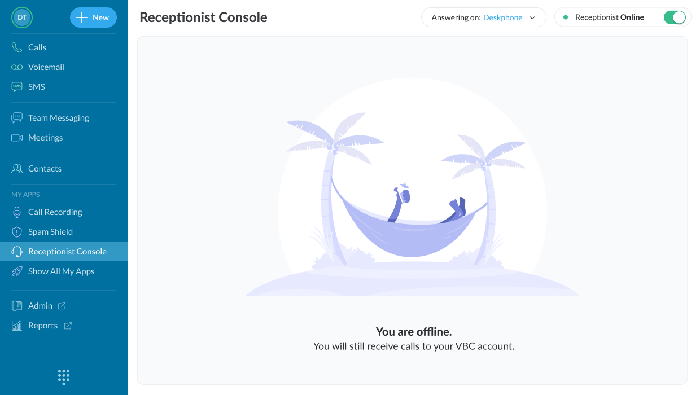

# Vonage Receptionist — Portfolio Case Study

> Source: Dave Orian's old portfolio (Webflow), page "Vonage Receptionist"
> Extracted in visual/DOM order, with page hierarchy preserved.

## Site navigation (top nav, sticky)

- **Dave Orian** (logo/home link) → `/`
- CV → https://drive.google.com/file/d/19i2iU_uEzZHtscwUIS_jOexJwxok70XU/view
- LinkedIn → https://www.linkedin.com/in/daveorian/
- About me → `/about-me`

## Project header

  |  **Receptionist**

### PROJECT OVERVIEW *(eyebrow/label)*

**Vonage Receptionist Console helps businesses manage inbound calls — transfer calls, create contact groups, and build call queues.** *(large bold headline)*

---

## The challenge / flow walkthrough

*Caption: An introductory splash screen announces the new Receptionist Console to existing users, explaining that it helps manage inbound calls — transferring calls, creating contact groups, and building a call queue.*

*Caption: An incoming call is presented to the receptionist with caller details, ready to be answered or routed.*

*Caption: The receptionist can place an active call on hold while looking up information or preparing to transfer.*

*Caption: The call transfer flow — the receptionist selects a contact or department to transfer the caller to.*

*Caption: Confirmation feedback is shown once the transfer completes, so the receptionist knows the call was successfully routed.*

*Caption: When a contact or department is offline or unavailable, the receptionist is informed so they can choose an alternative routing option.*

---

**NEXT PROJECT:** Vonage Business Cloud Mobile → *(link target not captured in this extraction pass — verify on source page)*

---

### Extraction notes

- This page's on-screen text was sparser than the Vonage Meetings case study — most of the storytelling is carried by the five numbered UI screenshots (hold → transfer → transfer feedback → offline) rather than paragraph copy. Captions above are inferred from the screenshot content and surrounding UI labels, not verbatim source copy — flag for review against the live page if verbatim captions are needed.
- Image order follows the visual/DOM order of the flow as presented on the page (splash → incoming → hold → transfer → transfer feedback → offline).
